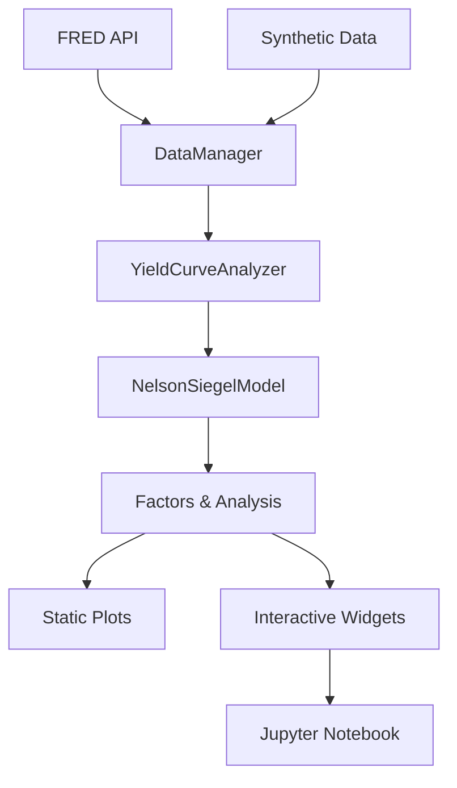
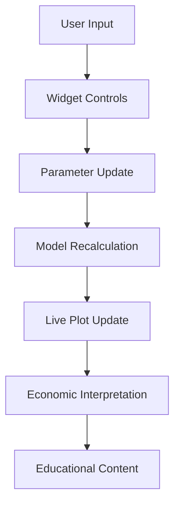

# 🏗️ Repository Architecture

This document describes the complete architecture of the Nelson-Siegel yield curve analysis repository, with special emphasis on the interactive Jupyter notebook integration.

## 📁 Repository Structure

```
nelson-siegel-model/
├── 📁 src/nelson_siegel/           # Main package source code
│   ├── __init__.py                 # Package initialization with smart imports
│   ├── model.py                    # Core Nelson-Siegel models
│   ├── data.py                     # Data download and management
│   ├── analysis.py                 # High-level analysis functionality
│   ├── plotting.py                 # Static visualization utilities
│   ├── interactive.py              # 🎛️ Interactive Jupyter widgets
│   └── py.typed                    # Type hints marker
│
├── 📁 examples/                    # Usage examples and tutorials
│   ├── basic_usage.py              # 🐍 Basic Python script examples
│   ├── legacy_nelson_siegel.py     # 🔄 Migration from original code
│   └── Nelson_Siegel_Interactive_Analysis.ipynb  # 📓 Main interactive notebook
│
├── 📁 tests/                       # Test suite
│   ├── __init__.py
│   ├── test_model.py               # Model functionality tests
│   ├── test_data.py                # Data download tests
│   ├── test_analysis.py            # Analysis function tests
│   └── test_interactive.py         # Interactive widget tests
│
├── 📁 docs/                        # Comprehensive documentation
│   ├── README.md                   # Documentation index
│   ├── installation.md             # 🚀 Installation guide
│   ├── notebooks.md                # 📓 Jupyter notebook guide
│   ├── model_theory.md             # 🔬 Mathematical foundations
│   ├── api_reference.md            # 📚 API documentation
│   └── interactive_guide.md        # 🎛️ Widget usage guide
│
├── 📁 scripts/                     # Command-line utilities
│   └── run_analysis.py             # 🤖 CLI analysis tool
│
├── 📁 binder/                      # Cloud deployment configuration
│   ├── requirements.txt            # Binder dependencies
│   └── postBuild                   # Binder setup script
│
├── 📁 .jupyter/                    # Jupyter configuration
│   └── jupyter_notebook_config.py  # Notebook optimization settings
│
├── 📄 pyproject.toml               # Modern Python packaging
├── 📄 README.md                    # Main project documentation
├── 📄 LICENSE                      # MIT license
├── 📄 .gitignore                   # Git ignore rules
└── 📄 ARCHITECTURE.md              # This file
```

## 🎯 Design Philosophy

### **1. Modular Architecture**
- **Separation of concerns**: Each module has a specific purpose
- **Clean interfaces**: Well-defined APIs between components
- **Optional dependencies**: Interactive features don't break core functionality

### **2. Progressive Enhancement**
- **Core functionality**: Works without interactive components
- **Enhanced experience**: Rich features with Jupyter widgets
- **Graceful degradation**: Fallbacks when widgets unavailable

### **3. Educational Focus**
- **Learning-first design**: Structure supports educational use
- **Interactive exploration**: Hands-on parameter manipulation
- **Economic context**: Every feature includes economic interpretation

## 🧩 Component Architecture

### **Core Model Layer** (`src/nelson_siegel/model.py`)

```python
# Base model with flexible configuration
NelsonSiegelModel(bounds, initial_guess)
├── fit(maturities, yields)
├── predict(maturities)
├── get_factors()
└── calculate_deviations()

# Specialized pre-configured models
TreasuryNelsonSiegelModel()  # Optimized for nominal yields
TIPSNelsonSiegelModel()      # Optimized for real yields
```

### **Data Management Layer** (`src/nelson_siegel/data.py`)

```python
# Unified data interface
DataManager(fred_api_key)
├── get_treasury_data()
├── get_tips_data()
└── get_all_data()

# Specialized downloaders
TreasuryDataDownloader()     # FRED Treasury series
TIPSDataDownloader()         # FRED TIPS series
```

### **Analysis Layer** (`src/nelson_siegel/analysis.py`)

```python
# High-level analysis interface
YieldCurveAnalyzer(fred_api_key)
├── analyze_single_curve()
├── analyze_historical_factors()
├── compare_curves()
└── generate_report()
```

### **Visualization Layer** (`src/nelson_siegel/plotting.py`)

```python
# Static plotting utilities
YieldCurvePlotter(style, figsize)
├── plot_yield_curve_fit()
├── plot_historical_factors()
├── plot_factor_comparison()
└── create_summary_dashboard()
```

### **Interactive Layer** (`src/nelson_siegel/interactive.py`) 🎛️

```python
# Real-time parameter exploration
InteractiveYieldCurveExplorer(bond_type, fred_api_key)
├── create_parameter_widgets()
├── plot_interactive_curve()
├── create_educational_content()
└── create_full_interactive_dashboard()

# Historical analysis widgets
HistoricalFactorExplorer(fred_api_key)
├── load_historical_data()
└── create_historical_dashboard()

# Educational utilities
create_yield_curve_tutorial()
```

## 📓 Jupyter Notebook Integration

### **Smart Import System**

The package uses intelligent imports to handle optional dependencies:

```python
# In __init__.py
try:
    from .interactive import (
        InteractiveYieldCurveExplorer,
        HistoricalFactorExplorer,
        create_yield_curve_tutorial
    )
    HAS_INTERACTIVE = True
except ImportError:
    HAS_INTERACTIVE = False
```

### **Notebook Architecture**

The main interactive notebook follows a structured educational approach:

```python
# Chapter-based organization
Chapter 1: Yield Curve Fundamentals     # 📚 Economic theory
Chapter 2: Nelson-Siegel Theory         # 🔬 Mathematical foundation  
Chapter 3: Interactive Exploration      # 🎛️ Parameter manipulation
Chapter 4: Economic Interpretation      # 💡 Real-world meaning
Chapter 5: Historical Analysis          # 📈 Time series patterns
Chapter 6: Practical Applications       # 💼 Investment strategies
Chapter 7: Advanced Strategies          # 🎯 Portfolio optimization
Chapter 8: Summary & Next Steps         # 🏁 Conclusions
```

### **Widget Design Patterns**

All interactive widgets follow consistent patterns:

```python
# Standard widget structure
def create_widget():
    # 1. Parameter controls (sliders, dropdowns)
    controls = create_parameter_widgets()
    
    # 2. Interactive plotting function
    def plot_function(**params):
        # Update visualization based on parameters
        pass
    
    # 3. Educational content
    educational_content = create_educational_content()
    
    # 4. Combined dashboard
    dashboard = widgets.VBox([
        educational_content,
        controls,
        interactive_plot
    ])
    
    return dashboard
```

## 🔧 Development Architecture

### **Dependency Management**

The project uses a tiered dependency system:

```toml
# pyproject.toml structure
[project]
dependencies = [...]              # Core requirements only

[project.optional-dependencies]
dev = [...]                      # Development tools
interactive = [...]              # Jupyter notebook features  
data = [...]                     # Additional data sources
notebooks = [...]                # Complete notebook environment
```

### **Testing Strategy**

```python
# Test organization
tests/
├── test_model.py           # Core model functionality
├── test_data.py            # Data download and processing
├── test_analysis.py        # High-level analysis functions
├── test_plotting.py        # Static visualization
└── test_interactive.py     # Widget functionality (if available)
```

### **Code Quality**

```yaml
# Automated quality checks
- Black: Code formatting
- isort: Import sorting  
- mypy: Type checking
- flake8: Linting
- pytest: Testing with coverage
```

## 🌐 Deployment Architecture

### **Local Development**

```bash
# Development installation
pip install -e ".[dev,interactive]"

# Jupyter Lab with widgets
jupyter lab examples/Nelson_Siegel_Interactive_Analysis.ipynb
```

### **Cloud Deployment**

#### **Binder Configuration**
```
binder/
├── requirements.txt        # Python dependencies
└── postBuild              # Jupyter extension setup
```

#### **Google Colab Support**
```python
# Automatic dependency installation
!pip install git+https://github.com/repo/nelson-siegel-model.git[interactive]
```

### **Package Distribution**

```python
# Modern Python packaging
pyproject.toml              # Single configuration file
src/nelson_siegel/          # Source layout
└── py.typed                # Type hints support
```

## 📊 Data Flow Architecture

### **Data Pipeline**



### **Interactive Flow**



## 🎛️ Widget Architecture

### **Widget Hierarchy**

```python
InteractiveYieldCurveExplorer
├── Parameter Controls
│   ├── Level Slider (β₀)
│   ├── Slope Slider (β₁)
│   ├── Curvature Slider (β₂)
│   └── Tau Slider (λ)
├── Display Options
│   ├── Show Market Data
│   └── Show Components
├── Real-time Plotting
│   ├── Main Curve Plot
│   └── Component Decomposition
└── Educational Content
    ├── Economic Interpretation
    └── Investment Implications
```

### **Event Handling**

```python
# Widget event flow
User Interaction → Widget Value Change → 
Model Update → Plot Refresh → UI Update
```

## 🔄 Migration Architecture

### **Legacy Compatibility**

The repository maintains compatibility with the original script while providing modern architecture:

```python
# examples/legacy_nelson_siegel.py
# Recreates original workflow using new components
original_function() → new_class_method()
```

### **Migration Path**

```python
# Old approach (original script)
def plot_curve(curve='Bonos'):
    # Monolithic function
    pass

# New approach (modular)
analyzer = YieldCurveAnalyzer()
result = analyzer.analyze_single_curve('treasury')
plotter = YieldCurvePlotter()
plotter.plot_yield_curve_fit(result)
```

## 🎯 Performance Architecture

### **Optimization Strategies**

1. **Lazy Loading**: Interactive components only loaded when needed
2. **Caching**: Historical data cached to avoid repeated downloads
3. **Efficient Widgets**: Minimal recomputation on parameter changes
4. **Memory Management**: Proper cleanup of large datasets

### **Scalability Considerations**

```python
# Efficient data handling
- Chunked historical analysis
- Subset selection for large datasets  
- Progress indicators for long operations
- Configurable computation limits
```

## 🎓 Educational Architecture

### **Learning Progression**

```python
# Structured learning path
1. Concepts → 2. Theory → 3. Interactive → 4. Applications
```

### **Interactivity Levels**

```python
Level 1: Static Examples      # basic_usage.py
Level 2: Interactive Widgets  # Real-time parameter exploration
Level 3: Custom Analysis      # User-defined scenarios
Level 4: Advanced Applications # Portfolio optimization
```

## 🔮 Future Architecture

### **Planned Enhancements**

1. **Advanced Models**: Svensson extension, dynamic factors
2. **Web Interface**: Flask/Dash web application
3. **Real-time Data**: Live market data feeds
4. **Machine Learning**: AI-enhanced parameter estimation

### **Extensibility**

The architecture supports easy extension:

```python
# Adding new models
class CustomNelsonSiegelModel(NelsonSiegelModel):
    # Custom implementation
    pass

# Adding new widgets
class CustomExplorer(InteractiveYieldCurveExplorer):
    # Enhanced functionality
    pass
```

---

This architecture provides a **robust, scalable, and educational foundation** for yield curve analysis with comprehensive interactive capabilities. The modular design ensures maintainability while the progressive enhancement approach makes it accessible to users with different technical requirements. 🚀
